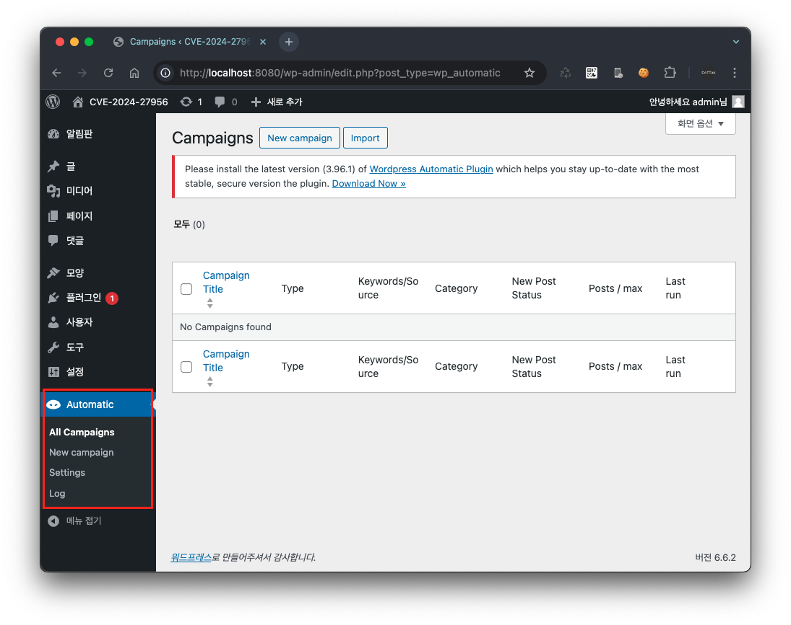
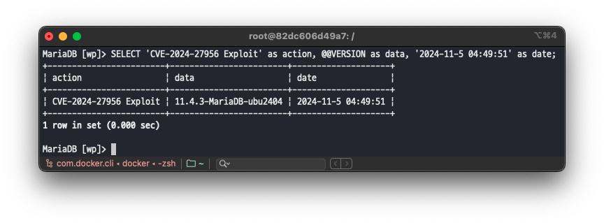
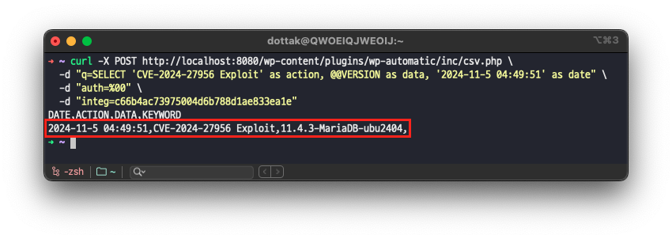
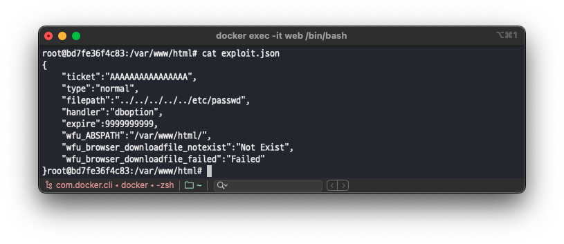

# CVE-2024-52427

## Index
* [📌 Analysis](#-Analysis)
    * [1. 개요](#1-개요)
    * [2. 플러그인 설명](#2-플러그인-설명)
    * [3. 취약점 분석](#3-취약점-분석)
* [📌 PoC](#-POC)
* [📌 패치확인](#-패치확인)

## 📌 Analysis

### 1. 개요

`CVE-2024-52427`은 [Event Tickets with Ticket Scanner](https://wordpress.org/plugins/event-tickets-with-ticket-scanner/)(이하, Event Tickets) WordPress 플러그인 2.3.11 버전 이하에서 발견된 Server Side Include(SSI) Injection 취약점입니다. 이 취약점은 해당 플러그인에서 사용하는 `Twig` 템플릿 엔진의 특수 요소를 적절히 필터링하지 않아 발생하며, 글 쓰기 권한이 있는 사용자(`Contributor` 권한 이상)가 악의적인 코드를 삽입해 서버에 시스템 명령어를 실행할 수 있습니다.

### 2. 플러그인 설명

Event Tickets은 WordPress 웹사이트에서 이벤트 티켓을 생성하고 관리할 수 있는 플러그인입니다.

예를 들어, 콘서트 입장권 판매 시 상품 등록 단계에서 입장권 정보를 입력하면 상품을 구매한 고객에게 상품 정보가 포함된 티켓이 자동으로 부여됩니다.


*[상품 등록 시 티켓 정보 입력]*


*[상품 주문 완료 화면 내 티켓 정보]*

위 상품 주문 완료 화면 내 티켓 정보를 클릭할 경우 상품 구매 정보와 QR 코드가 담긴 티켓을 발급받을 수 있습니다.


또한 QR 코드를 통한 티켓 스캔 기능을 제공하며, 티켓 템플릿 커스터마이징, 이벤트 관리, 결제 처리 등 다양한 기능을 제공합니다.


*[티켓 스캐너 1]*


*[티켓 스캐너 2]*

### 3. 취약점 분석

> ⚠️  CVE 정보에는 취약점 발생에 필요한 최소 권한이 작성자(`Author`) 수준이라고 명시되어 있으나, 실제로는 더 낮은 권한인 기여자(`Contributor`) 수준에서도 취약점이 발생합니다. 따라서 본 분석은 기여자(`Contributor`) 권한을 기준으로 수행하였습니다.


Event Tickets 플러그인은 템플릿 커스터마이징 기능을 통해 티켓 페이지를 꾸밀 수 있습니다. 해당 커스터마이징 기능은 Event Tickets 설정 메뉴(`/wp-admin/admin.php?page=event-tickets-with-ticket-scanner`)의 ‘`Options`’ 내 티켓 템플릿 설정에서 확인할 수 있습니다. 


*[Event Tickets 설정 메뉴]*


*[Event Tickets 설정 메뉴 내 티켓 페이지 템플릿 설정]*

이 설정에서는 `HTML` 과 `Twig` 템플릿 문법을 사용하여 티켓의 디자인과 내용을 자유롭게 수정할 수 있도록 허용하고 있습니다. 

하지만 Event Tickets 플러그인은 사용자가 입력한 `Twig` 템플릿 코드를 적절히 검증하지 않아 악의적인 코드가 실행될 수 있는 취약점이 있습니다. 또한, 해당 플러그인의 설정 메뉴는 기여자(`Contributor`) 수준의 낮은 접근 권한으로도 이용할 수 있으므로 취약점 악용의 위험성이 높습니다. 


기여자(’Contributor’) 권한을 가진 사용자의 Event Tickets 설정 메뉴의 티켓 페이지 템플릿 설정 

따라서 WordPress의 기여자(`Contributor`) 권한은 일반적으로 콘텐츠 작성과 편집만 가능하지만, 이 취약점을 통해 서버의 시스템 명령어를 실행할 수 있으므로 심각한 보안 위험을 초래할 수 있습니다.

## 📌 POC

> ⚠️ PoC는 `Event Tickets with Ticket Scanner <= 2.3.11` 의 기여자(`Contributor`) 권한으로 진행했습니다. <br>
> &nbsp;&nbsp;&nbsp;&nbsp;해당 플러그인은 `plugins/event-tickets-with-ticket-scanner.2.3.11.zip` 에서 설치할 수 있습니다.

</aside>

접근 권한이 기여자(`Contributor`)인 계정으로 로그인을 수행한 후 Event Tickets 설정 메뉴(`/wp-admin/admin.php?page=event-tickets-with-ticket-scanner`)로 이동하여 티켓 템플릿 설정 영역으로 이동 합니다.


현재 위와 같이 설정된 템플릿 내용은 티켓 페이지를 아래와 같이 출력하고 있습니다.


이후 템플릿 내용을 `cat /etc/passwd` 명령을 수행하는 아래의 코드로 작성합니다.

```
{{['cat /etc/passwd'] | filter('system')}}
```


그 다음 티켓 페이지를 새로고침 하면 다음과 같이 입력된 명령어 `cat /etc/passwd` 의 결과를 출력하는 것을 확인할 수 있습니다.



## 📌 패치확인
> ⚠️ 본 내용은 CVE-2024-52427 제보자의 원본 PoC 코드를 직접 확인할 수 없어, CVE 제보 내용을 바탕으로 재현한 결과를 정리한 것입니다.

[CVE-2024-52427](https://www.cve.org/CVERecord?id=CVE-2024-52427) 정보에 따르면 해당 취약점은 Event Tickets 플러그인 `2.3.11` 이하 버전에서 영향을 받으며, `2.3.12` 이후 버전에서는 영향을 받지 않는다고 나와있습니다.



그러나 플러그인 개발 기록을 확인하고 해당 취약점에 영향을 받지 않는 버전의 상위 버전인 `2.4.0` 을 대상으로 PoC를 수행한 결과, 패치는 `2.4.1` 버전부터 이루어진 것을 확인하였습니다.

> [https://plugins.trac.wordpress.org/changeset/3172740/event-tickets-with-ticket-scanner?old=3160714&old_path=%2Fevent-tickets-with-ticket-scanner#file1690](https://plugins.trac.wordpress.org/changeset/3172740/event-tickets-with-ticket-scanner?old=3160714&old_path=%2Fevent-tickets-with-ticket-scanner#file1690)
> 



/wp-content/plugins/event-tickets-with-ticket-scanner/sasoEventtickets_Options.php

위 코드 내용은 Event Tickets 플러그인의 설정 메뉴 중 아래 접근과 관련된 설정입니다.



즉, Event Tickets 플러그인의 설정 메뉴의 접근 권한을 관리자(`Administrator`) 또는 접근 설정에 선택된 역할에만 할당하는 것을 기본 값(Default)으로 설정하고 있습니다. 

따라서, 해당 취약점은 Event Tickets 플러그인 설정 메뉴의 기본 접근 권한의 변경을 통해 패치 되었습니다.